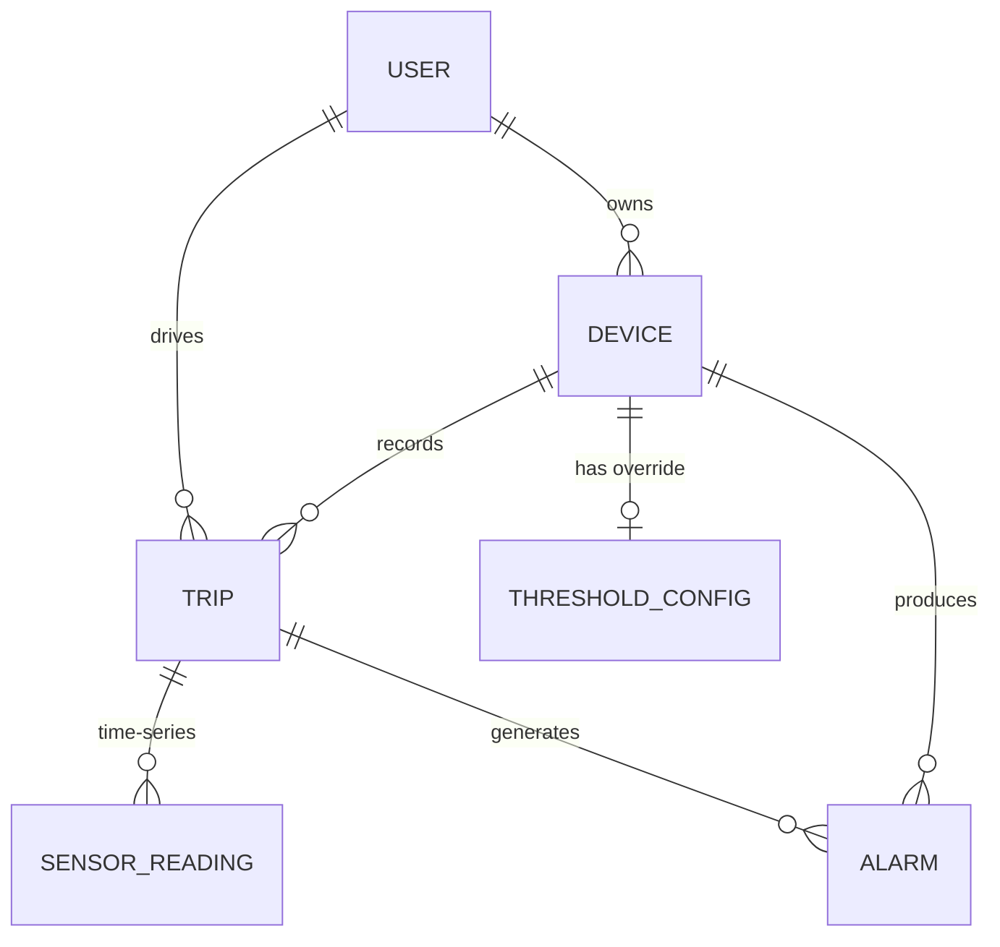

# Veri Modeli — 3NF İlkeleriyle MongoDB

> MongoDB bir doküman veritabanı olsa da bu projede ilişkisel normalizasyon
> idealleri uygulanır: her varlık kendi koleksiyonunda yaşar, veri tekrarı
> yoktur, referanslar `ObjectId` üzerinden kurulur, türetilmiş değerler kalıcı
> olarak saklanmaz.

## Varlık-İlişki Diyagramı



## Koleksiyonlar ve Normalizasyon Gerekçeleri

### `users` (3NF)

| Alan | Tip | Notlar |
|-------|------|-------|
| `_id` | ObjectId | Birincil anahtar |
| `username` | String, tekil | Atomik (1NF) |
| `passwordHash` | String | Parola hash'i tam kimlik akışı üretilirken doldurulur (bu modülün kapsamı dışında) |
| `role` | enum `admin` / `driver` | |
| `createdAt`, `updatedAt` | Date | Mongoose `timestamps` |

3NF: Anahtar olmayan her sütun yalnızca `_id` üzerinden bağımlıdır. Tam kimlik modeli bu modülün kapsamı dışında olduğundan bu şema bilinçli olarak minimum tutulmuştur.

### `devices` (3NF)

| Alan | Tip | Notlar |
|-------|------|-------|
| `_id` | ObjectId | Birincil anahtar |
| `userId` | ObjectId → `users` | indeksli |
| `label` | String | Atomik |
| `platform` | enum `android` / `ios` | |
| `model`, `appVersion` | String, opsiyonel | |
| `registeredAt`, `lastSeenAt` | Date | |

3NF: Geçişli (transitive) kullanıcı bilgisi (username vb.) **saklanmaz** — `userId` üzerinden join ile alınır.

### `trips` (3NF)

| Alan | Tip | Notlar |
|-------|------|-------|
| `_id` | ObjectId | Birincil anahtar |
| `deviceId` | ObjectId → `devices` | indeksli |
| `userId` | ObjectId → `users` | **Trip başlangıcında materyalize edilir.** O trip için _sürücüyü_ kayıt altına alır; bu bağımsız bir olgudur (cihaz daha sonra başka bir kullanıcıya atanabilir). Bu nedenle geçişli bir bağımlılık değildir. |
| `startedAt`, `endedAt` | Date | |
| `summary` | alt-doküman | Trip sonunda hesaplanan materyalize özet (`totalAlarms`, `alarmByType`, `averageSpeedMs`). |
| `status` | enum `active` / `ended` | |

### `sensor_readings` (MongoDB time-series koleksiyonu)

Şu seçeneklerle oluşturulur:

```js
{
  timeseries: { timeField: 'ts', metaField: 'meta', granularity: 'seconds' },
  expireAfterSeconds: 2_592_000   // 30 günlük TTL — gizlilik
}
```

| Alan | Tip |
|-------|------|
| `ts` | Date (UTC, ms hassasiyetinde) |
| `meta.deviceId` | ObjectId |
| `meta.tripId` | ObjectId |
| `accel.{x,y,z}` | Number (m/s²) |
| `gyro.{x,y,z}` | Number (rad/s) |
| `gps.{lat,lng,speed,accuracy}` | Number, opsiyonel |
| `speed` | Number, opsiyonel |

Gerekçe: Time-series bucket'lar **fiziksel** depolama biçimidir, denormalizasyon değildir. Mantıksal olarak her okuma; bir cihaz/trip için bir anda gerçekleşen tek bir olgudur. Dışarıda bırakılan sensörler (mikrofon, manyetometre, ışık vb.) [README'nin Gizlilik bölümünde](../README.md#gizlilik-ve-veri-saklama) listelenir.

### `alarms` (3NF — bilinçli snapshot ile)

| Alan | Tip | Notlar |
|-------|------|-------|
| `_id` | ObjectId | Birincil anahtar |
| `deviceId` | ObjectId → `devices` | indeksli |
| `tripId` | ObjectId → `trips` | indeksli |
| `type` | enum 4 anomali türü | indeksli |
| `severity` | enum `low`/`medium`/`high` | |
| `value` | Number | Ölçülen tepe değer |
| `threshold` | Number | Tespit anındaki eşiğin **anlık görüntüsü** |
| `unit` | String | `m/s2` veya `rad/s` |
| `windowStart`, `windowEnd` | Date | |
| `gps` | `{lat,lng}`, opsiyonel | |
| `evidence` | Object, opsiyonel | |
| `createdAt`, `updatedAt` | Date | |

`threshold` anlık görüntüsü "türetilmiş alan saklama" kuralını bilinçli olarak esnetir. Gerekçe: Bir alarm gelecekteki eşik değişikliklerinden sonra bile **yorumlanabilir** kalmalıdır; aksi takdirde denetim sırasında anlamını yitirir. Bu, tek seferlik bir materyalizasyondur (alarmlar tekrar değerlendirilmez), tekrarlayan bir veri çoğullaması değildir.

### `threshold_configs` (3NF, cihaz başına opsiyonel 0..1 override)

| Alan | Tip | Notlar |
|-------|------|-------|
| `_id` | ObjectId | Birincil anahtar |
| `deviceId` | ObjectId → `devices`, **tekil** | 0..1 : 1 — bir cihaz için en fazla bir override dokümanı |
| `overrides` | seyrek alt-doküman | Yalnızca varsayılandan farklı değerler |
| `updatedBy` | ObjectId → `users` | |

Varsayılanlar `src/config/thresholds.js` (uygulama düzeyinde, deploy ile evrilir). Koleksiyon yalnızca **deltayı** saklar → minimum veri çoğullaması. Bir cihazın hiç override'ı yoksa o cihaz için doküman oluşturulmaz; `getDeviceThresholds` `null` döner ve dedektörler tamamen varsayılanlar üzerinden çalışır.

### `analysis_runs` (denetim)

Her ingest batch'inin kim/ne zaman analiz edildiğini kaydeder. Opsiyoneldir, dedektör pipeline'ını debug etmek için kullanılır.

## İndeks Stratejisi

| Koleksiyon | İndeks | Amaç |
|------------|-------|---------|
| `users` | `{ username: 1 }` tekil | Arama + tekillik |
| `devices` | `{ userId: 1 }` | Sahip bazlı listeler |
| `devices` | `{ lastSeenAt: 1 }` | Çevrimiçi filtreleri |
| `trips` | `{ deviceId: 1, startedAt: -1 }` | Cihaz başına en yeni tripler |
| `trips` | `{ status: 1 }` | Aktif trip arama |
| `alarms` | `{ deviceId: 1, createdAt: -1 }` bileşik | İzleme paneli "son alarmlar" görünümü |
| `alarms` | `{ tripId: 1 }` | Trip başına alarm listesi |
| `alarms` | `{ type: 1 }` | Anomali türüne göre filtre |
| `threshold_configs` | `{ deviceId: 1 }` tekil | 1:1 cihaz → override |
| `sensor_readings` | Otomatik bileşik `meta + ts` | MongoDB time-series 6.3+ bunu otomatik kurar |
